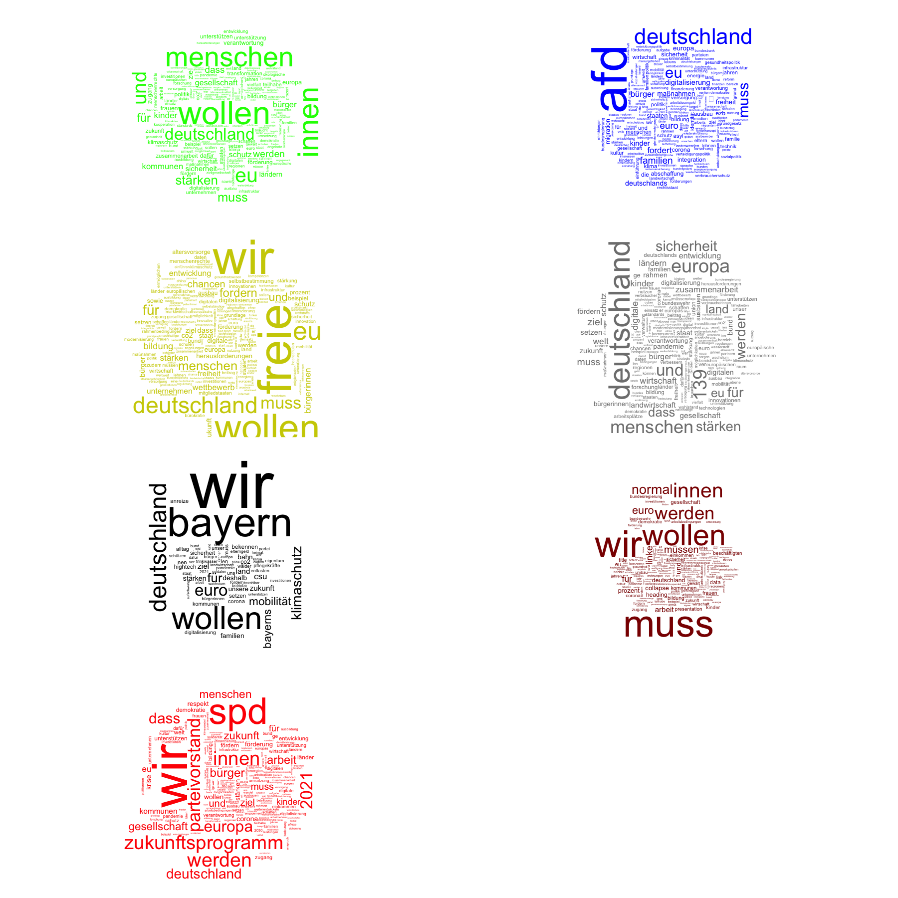

```{r setup, include=FALSE}
knitr::opts_chunk$set(echo = TRUE)
```

In diesem kurzen Tutorial möchte ich am Beispiel der Wahlprogramme der derzeit im Bundestag vertretenen Parteien für die Bundestagswahl 2021 zeigen, wie man mit Hilfe von [R](https://cran.r-project.org/) einfache Keyword-Analysen durchführen kann. Wer dem Tutorial wirklich folgen möchte, muss Grundkenntnisse in R mitbringen - einen ersten Einstieg bietet beispielsweise mein entsprechendes Tutorial [hier](https://hartmast.github.io/sprachgeschichte-begleitmaterial/) ebenso wie zahlreiche andere Ressourcen, die online zu finden sind. Wer einfach nur den Prozess verfolgen und die Ergebnisse sehen möchte, kann aber gern mitlesen bzw. den Code copy&pasten, ohne genauer verstehen zu müssen, was "hinter den Kulissen" passiert.

## Pakete

Wir laden zunächst ein paar Zusatzpakete: pdftools erlaubt uns, PDF-Dateien einzulesen; die "tidyverse"-Paketfamilie bietet einige nützliche Funktionen für die Datenaufbereitung und -analyse, und das "tidytext"-Paket vereinfacht die Arbeit mit n-Grammen (dazu später mehr). Das Paket "wordcloud" erlaubt die Erstellung von Wortwolken, was wir gegen Ende des Tutorials tun wollen -- wissenschaftlich gesehen kein besonders erkenntnisträchtiges Visualisierungsformat, aber durchaus geeignet, um einen ersten Eindruck von den Daten zu gewinnen, und daher auch in der populärwissenschaftlichen Vermittlung von (sprach-)wissenschaftlichen Forschungsergebnissen sehr populär. Das Paket "stopwords" schließlich brauchen wir, um die titelgebenden Stopwords auszuschließen -- was das ist, werden wir ebenfalls weiter unten erfahren.

```{r pkgs, message = FALSE, warning = FALSE}

# falls noch nicht installiert, können Sie die benötigten
# Pakete wie folgt installieren (das # am Zeilenanfang
# entfernen, um den Code ausführen zu können):

# install.packages("tidyverse")
# install.packages("pdftools")
# install.packages("tidytext")
# install.packages("pdftools")
# install.packages("stopwords")
# install.packages("DT") # für Darstellung der Tabellen


# packages ----------------------------------------------------------------
library(tidyverse)
library(tidytext)
library(pdftools)
library(wordcloud)
library(stopwords)
library(DT)

```

## Daten einlesen

Das Wichtigste zuerst: Wir müssen die Texte der einzelnen Programme einlesen. Die Programme liegen zumeist im PDF-Format vor. Einzig bei der Linken findet sich (Stand 09.07.2021) kein PDF, daher nehmen wir mit der HTML-Variante vorlieb (die ohnehin einfacher einzulesen ist). Die Links sind derzeit (Stand Juli 2021) noch aktuell, können sich aber natürlich prinzipiell ändern.

```{r getdata, warnings = FALSE, message = FALSE, eval = FALSE}

spd_text <- pdftools::pdf_text("https://www.spd.de/fileadmin/Dokumente/Beschluesse/Programm/SPD-Zukunftsprogramm.pdf")
gruene_text <- pdftools::pdf_text("https://cms.gruene.de/uploads/documents/Vorlaeufiges-Wahlprogramm_GRUENE-Bundestagswahl-2021.pdf")
cdu_text <- pdftools::pdf_text("https://www.ein-guter-plan-fuer-deutschland.de/programm/CDU_Beschluss%20Regierungsprogramm.pdf")
csu_text <- pdftools::pdf_text("https://www.csu.de/common/download/CSU-Programm_Gut_fuer_Bayern_Gut_fuer_Deutschland_final.pdf")
fdp_text <- pdf_text("https://www.fdp.de/sites/default/files/2021-06/FDP_Programm_Bundestagswahl2021_1.pdf")
afd_text <- pdf_text("https://cdn.afd.tools/wp-content/uploads/sites/111/2021/06/20210611_AfD_Programm_2021.pdf")
linke <- readLines("https://www.die-linke.de/wahlen/wahlprogramm-2021/")


```

```{r export, eval = FALSE, include = FALSE}

# saveRDS(linke_text, "linke.Rds")
# saveRDS(afd_text, "afd.Rds")
# saveRDS(cdu_text, "cdu.Rds")
# saveRDS(csu_text, "csu.Rds")
# saveRDS(fdp_text, "fdp.Rds")
# saveRDS(spd_text, "spd.Rds")
# saveRDS(gruene_text, "gruene.Rds")

```

```{r reimport, include = FALSE}

spd_text <- readRDS("spd.Rds")
cdu_text <- readRDS("cdu.Rds")
csu_text <- readRDS("csu.Rds")
fdp_text <- readRDS("fdp.Rds")
gruene_text <- readRDS("gruene.Rds")
afd_text <- readRDS("afd.Rds")
linke_text <- readRDS("linke.Rds")

```

Für das Einlesen von HTML-Dateien gibt es alternativ die Möglichkeit, mit [Trafilatura](https://trafilatura.readthedocs.io/en/latest/) (Barbaresi 2021) zu arbeiten. Trafilatura hat den großen Vorteil, dass es die Möglichkeit bietet, all das unerwünschte "Beiwerk", das wir beim Einlesen von HTML-Dateien mit crawlen (also z.B. HTML-Codes) einigermaßen zuverlässig automatisch auszufiltern. Wie das in R geht, ist [in der Dokumentation](https://trafilatura.readthedocs.io/en/latest/usage-r.html?highlight=mit%20r) des Tools genauer nachzulesen; um im Schnelldurchlauf zu sehen, wie wir Trafilatura zum Einlesen des Wahlprogramms der Linken verwenden können, klicken Sie hier:

<details>

<summary>klick mich</summary>

Wir brauchen zusätzlich das Paket `reticulate`, das eine Schnittstelle für Python bietet. Natürlich funktioniert der Code nur, wenn auch Trafilatura installiert ist (wie das geht, ist der oben verlinkten Dokumentation zu entnehmen) -- daher arbeite ich im restlichen Tutorial einfach mit dem `readLines`-Befehl.


```{r trafi, eval = FALSE}

library(reticulate)

trafilatura <- import("trafilatura")
downloaded <- trafilatura$fetch_url("https://www.die-linke.de/wahlen/wahlprogramm-2021/")
linke_trafi <- trafilatura$extract(downloaded)

```


</details>


```{r linksexport, eval = FALSE, include = FALSE}

# saveRDS(linke_trafi, "linke_trafi.Rds")

```

```{r linksimport, include = FALSE}

# re-import Trafilatura version
linke_trafi <- readRDS("linke_trafi.Rds")


```

<p style="background-color:rgba(203, 214, 11, 0.3);">

Der Text befindet sich nun im Objekt `linke_trafi`.

</p>

Nun haben wir die Wahlprogramme in jeweils einem Objekt gespeichert, das nach den einzelnen Parteien benannt ist. Streng genommen wäre es sinnvoll, diese Daten noch zu bereinigen, da beispielsweise das Linken-Programm, weil wir es aus der HTML-Seite extrahiert haben, noch HTML-Markup und sog. Boilerplate-Text enthält, also Text, der auf praktisch allen (Unter-)Seiten wiederverwendet wird.

```{r example}

head(linke_text, 10)

```

Ähnlich gibt es bei den anderen Programmen z.B. Seitenzahlen, die wir bei einer sorgfältigeren Analyse tilgen würden. Auch wäre es sinnvoll, statt mit den Wortformen mit Lemmas (also Grundformen von Wörtern) zu arbeiten -- dafür müssten wir aber mit Lemmatisierung oder zumindest mit [Stemming](https://en.wikipedia.org/wiki/Stemming) arbeiten. Wer sich zur Lemmatisierung (und zum Wortartentagging) mit Hilfe des verbreiteten Tools TreeTagger näher einlesen möchte, findet bei [Noah Bubenhofer](http://www.bubenhofer.com/korpuslinguistik/kurs/index.php?id=eigenes_postagging.html) weiterführende Informationen. Mit [TagAnt](https://www.laurenceanthony.net/software/tagant/) von Laurence Anthony gibt es mittlerweile auch eine grafische Benutzeroberfläche für den TreeTagger.

Für unsere illustrative Analyse wollen wir uns aber mit den hier vorliegenden unsauberen Datensätzen begnügen und sie nur minimal weiter bereinigen (s.u.).

## Vergleichsdatensatz

Für die Analyse bieten sich nun mehrere Optionen an. Bei einer Keyword-Analyse geht es darum, herauszufinden, welche Wörter für einen gegegebenen Datensatz besonders charakteristisch sind. Dafür braucht man natürlich einen Vergleichsdatensatz. Wir werden im Folgenden die Wortfrequenzliste des [Digitalen Wörterbuchs der Deutschen Sprache](https://www.dwds.de) verwenden. Diese lässt sich über [das Tool "Dstar"](https://kaskade.dwds.de/dstar/kern/) mit der Suchanfrage `count(* #sep)` erstellen. Wir lesen sie hier ein:

```{r vgl, message = FALSE}

dwds <- read_delim("dwds_kern_frequency_list.txt", delim = "\t", quote = "", col_names = c("Freq", "Token"))

```

Außer mit einzelnen Wörtern können wir auch mit *N-Grammen* arbeiten. N-Gramme sind Wortfolgen von jeweils N Wörtern -- ein Satz wie *Das Pferd frisst keinen Gurkensalat* lässt sich zerlegen in die Bigramme (2-Gramme) *Das Pferd, frisst keinen, keinen Gurkensalat* oder in die Trigramme (3-Gramme) *Das Pferd frisst, Pferd frisst keinen, frisst keinen Gurkensalat*. Das Prinzip dabei ist ähnlich wie bei der Keyword-Analyse auf Einzelwortebene: Wir wollen wissen, welche Wortfolgen besonders häufig vorkommen. Für die n-Gramm-Analyse werden wir allerdings keine existierende N-Gramm-Liste als Vergleichsdatensatz verwenden, sondern vielmehr die N-Gramm-Listen der einzelnen Parteien miteinander vergleichen.

## Wortfrequenzlisten der Parteiprogramme

Um zunächst die Einzelwortfrequenzen der Parteiprogramme mit der DWDS-Frequenzliste vergleichen zu können, müssen wir zunächst eine Tabelle mit den Wortfrequenzen in den einzelnen Dokumenten erstellen - man spricht hier manchmal auch von einer *term-document matrix*. Bevor wir das tun, bereinigen wir die Daten zunächst noch, indem wir die Interpunktion, Zeilenumbrüche etc. entfernen. Außerdem heben wir Groß- und Kleinschreibung auf, um die Daten besser analysieren zu können, und schließen Wörter wie *kapitel, seite* und reine Zahlenfolgen aus. Daraufhin nutzen wir die `strsplit`-Funktion, mit denen man, wie ihr Name verrät, Strings splitten kann, um an die einzelnen Wörter (definiert als das, was zwischen zwei Leerzeichen steht) zu gelangen. Dafür splitten wir den Text an den Leerzeichen auf. Wir erhalten dann einen sehr großen Vektor mit Einzelwörtern, die wir daraufhin mit der `table`-Funktion auszählen und in einen Dataframe überführen. Das Ganze gießen wir in eine Funktion, die wir auf die einzelnen Parteiprogramme anwenden können.

```{r bereinigung, class.source = "fold-hide"}

count_tokens <- function(d) {
  # Interpunktion und Zeilenumbrüche weg:
d <- gsub("[[:punct:]]|\n", " ", d)

# Tabstopps und mehrere Leerzeichen durch einfache Leerzeichen ersetzen:
d <- gsub("\t| +", " ", d)

# Groß- und Kleinschreibung entfernen:
d <- tolower(d)

# an Leerzeichen splitten, um an die Einzelwörter zu kommen:
d <- unlist(strsplit(d, " "))

# Wörter auszählen:
d <- table(d) %>% as.data.frame %>% arrange(desc(Freq))

# Spaltennamen umbenennen:
colnames(d) <- c("Token", "Freq")

# Wörter ausschließen
d <- d[!grepl("^kapitel$|^seite$|^[:digit:]*$", d$Token),]

# sicherstellen, dass d$Token character ist
d$Token <- as.character(d$Token)

return(d)

}

# Funktion auf die einzelnen Wahlprogramme anwenden:
fdp <- count_tokens(fdp_text)
spd <- count_tokens(spd_text)
afd <- count_tokens(afd_text)
gruene <- count_tokens(gruene_text)
linke <- count_tokens(linke_text)
cdu <- count_tokens(cdu_text)
csu <- count_tokens(csu_text)

```

Nun haben wir also Frequenzlisten für die einzelnen Parteien. Ein kurzer Blick in die häufigsten Wörter zeigt, dass sie uns nicht viel sagen, weil es sich zum großen Teil um dieselben Funktionswörter handelt:

```{r freqs}

head(fdp)
head(spd)

```

(Auf den ersten Blick auffällig ist lediglich die Häufigkeit von *werden* im SPD-Programm, das sie wohl nicht umsonst als "Zukunftsprogramm" betitelt hat.)

## Keywords

Wir wollen aber wissen, welche Wörter für die Wahlprogramme charakteristisch sind, welche also deutlich häufiger auftreten als in einem Vergleichsdatensatz.

### Assoziationsmaße

Um Keywords herausfinden zu können, stützen wir uns auf Assoziationsmaße. Davon gibt es eine ganze Menge (Evert 2005 gibt einen Überblick), wir benutzen zwei: [Log-Likelihood ratio](https://en.wikipedia.org/wiki/Likelihood-ratio_test) und den [Sørensen--Dice-Koeffizienten](https://en.wikipedia.org/wiki/S%C3%B8rensen%E2%80%93Dice_coefficient), oft auch nur Dice-Koeffizient genannt. Für beide Koeffizienten brauchen wir zunächst Funktionen. Die Funktionen habe ich aus Material übernommen, das meine Erlanger Kollegen Andreas Blombach und Phillip Heinrich für ein Seminar erarbeitet haben und das mit einiger Wahrscheinlichkeit auch Eingang in ein gemeinsames Buchprojekt finden wird, über das ich hoffentlich an anderer Stelle bald mehr berichten kann.

#### Log-Likelihood Ratio

```{r llr}

# diese Hilfsfunktion berechnet die erwarteten Frequenzen:
exp2x2 <- function(observed) {
  return(matrix(
    c(
      sum(observed[1,]) * sum(observed[,1]) / sum(observed),
      sum(observed[2,]) * sum(observed[,1]) / sum(observed),
      sum(observed[1,]) * sum(observed[,2]) / sum(observed),
      sum(observed[2,]) * sum(observed[,2]) / sum(observed)
    ),
    ncol = 2
  ))
}

# diese Funktion berechnet die Log-Likelihood Ratio:
llr <- Vectorize(function(freq1, freq2, corpus_size1, corpus_size2) {
  observed <- matrix(c(freq1, corpus_size1 - freq1,
                       freq2, corpus_size2 - freq2),
                     ncol = 2)
  expected <- exp2x2(observed)
  return(2 * sum(ifelse(observed > 0, observed * log(observed / expected), 0)))
})


```

#### Dice-Koeffizient

```{r dice}

dice <- Vectorize(function(freq1, freq2, corpus_size1, corpus_size2) {
  observed <- matrix(c(freq1, corpus_size1 - freq1,
                       freq2, corpus_size2 - freq2),
                     ncol = 2)
  return(2 * observed[1, 1] / sum(observed[1, 1], observed[1, 2],
                                  observed[1, 1], observed[2, 1]))
})

```

Ergänzend zur LLR können wir ein Maß der **Effektstärke** berechnen -- denn bei den LLR-Werten können selbst kleine Frequenzunterschiede zu großen LLRs führen. Wir wählen hierfür die [Odds Ratio](https://en.wikipedia.org/wiki/Odds_ratio). 

```{r oddsr}

# Funktion für odds ratio
odds_ratio <- Vectorize(function(freq1, freq2, corpus_size1, corpus_size2) {
  observed <- matrix(c(freq1, corpus_size1 - freq1,
                       freq2, corpus_size2 - freq2),
                     ncol = 2)
  return(
    (observed[1,1] / observed[2,1]) / (observed[1,2] / observed[2,2])
  )
})

```


### Anwendung der Assoziationsmaße

Die eben erstellten Funktionen `llr` und `dice` nehmen beide vier Argumente, also Variablen, mit denen wir sie "füttern" müssen: Die Frequenz der einzelnen Tokens in unserem Korpus (dem jeweiligen Wahlprogramm) und im Vergleichskorpus sowie die Gesamtfrequenz aller Tokens in den beiden Korpora. Um Letztere greifbar zu haben, erstellen wir sie, indem wir einfach die Frequenzen in den entsprechenden Dataframes aufsummieren:

```{r freqs2}

# Wahlprogramme:
gruene_size <- sum(gruene$Freq)
spd_size <- sum(spd$Freq)
fdp_size <- sum(fdp$Freq)
cdu_size <- sum(cdu$Freq)
csu_size <- sum(csu$Freq)
afd_size <- sum(afd$Freq)
linke_size <- sum(linke$Freq)

# DWDS:
dwds_size <- sum(dwds$Freq)

```

Nun können wir die LLR- bzw. Dice-Werte bekommen, indem wir die entsprechenden Werte einfach in die oben definierten Funktionen einsetzen. Wir nutzen hier die `left_join`-Funktion aus der Tidyverse-Paketfamilie, um zunächst an das jeweilige Parteiprogramm eine Spalte anzuhängen, die die DWDS-Gesamtfrequenzen aus dem `dwds`-Dataframe enthält, und dann die `mutate`-Funktion, um die LLR- und Dice-Werte einfach als weitere Spalten an die Wahlprogramme anzuhängen. Als Beispiel wählen wir einfach die alphabetisch erste der demokratisch ausgerichteten Parteien:

```{r bspfdp, message = FALSE}

# Spaltennamen ändern, um Gesamtfrequenz von FDP-Frequenz unterscheiden zu können:
colnames(cdu) <- c("Token", "Freq_cdu")

# DWDS-Frequenzen hinzufügen:
cdu <- left_join(cdu, dwds)

# NAs durch 0 ersetzen
cdu <- replace_na(cdu, list(Freq = 0, Freq_cdu = 0))

# Spalte mit Log-Likelihood hinzufügen:
cdu <- cdu %>% mutate(LLR = llr(cdu$Freq_cdu, cdu$Freq, cdu_size, dwds_size))

# Spalte mit Odds Ratio hinzufügen:
cdu <- cdu %>% mutate(odds_ratio = odds_ratio(cdu$Freq_cdu, cdu$Freq, cdu_size, dwds_size))

# Spalte mit Dice hinzufügen:
cdu <- cdu %>% mutate(Dice = dice(cdu$Freq_cdu, cdu$Freq, cdu_size, dwds_size)) %>% arrange(desc(LLR))

# Top 10, nach LLR sortiert (über arrange(desc(LLR)), s.o.)
cdu %>% head(10)

# nach Dice sortieren:
cdu %>% arrange(desc(Dice)) %>% head(10)

```

Dieses erste Ergebnis ist schon deutlich aufschlussreicher als die reine Tokenfrequenz, die wir oben angeschaut haben: Die Freien Demokraten wollen irgendetwas und fordern, dass Menschen - oder so. Und irgendwas mit EU. Schon die ersten zehn Keywords verraten relativ viel über zweierlei: Zum einen über die inhaltlichen Themen des Wahlprogramms, zum anderen - und das kommt zumindest bei den Top 10 noch etwas stärker zum Tragen - über die rhetorischen Strategien, die im Wahlprogramm angewandt werden.

Da wir das nun auch für die anderen Parteien machen wollen, lohnt es sich, das Ganze wieder in eine Funktion zu gießen und dann auf alle Parteien anzuwenden:

```{r getllranddice, message=FALSE, class.source = "fold-hide"}

# Funktion:

association_measures <- function(df) {
  
# welche Partei ist gerade dran? mit deparse(substitute())
# erhalten wir den Namen der Partei als character string:
partei <- deparse(substitute(df))

# das ist wichtig, weil wir die size-Variable der
# entsprechenden Partei brauchen.
df_size <- get(paste0(partei, "_size"))
    
# Spaltennamen ändern, um Gesamtfrequenz von df-Frequenz unterscheiden zu können:
colnames(df) <- c("Token", "Freq_df")

# DWDS-Frequenzen hinzufügen:
df <- left_join(df, dwds)

# NAs durch 0 ersetzen
df <- replace_na(df, list(Freq = 0, Freq_df = 0))

# Spalten mit Log-Likelihood, Odds Ratio, Dice und p-Wert hinzufügen:
df <- df %>% mutate(LLR = llr(df$Freq_df, df$Freq, df_size, dwds_size),
                    odds_ratio = odds_ratio(df$Freq_df, df$Freq, df_size, dwds_size),
                    Dice = dice(df$Freq_df, df$Freq, df_size, dwds_size),
                    p = pchisq(LLR, df = 1, lower.tail = FALSE)) %>% arrange(desc(LLR))


# ausgeben
return(df)

}


# auf die einzelnen Parteien angewendet:
spd <- association_measures(spd)
fdp <- association_measures(fdp)
linke <- association_measures(linke)
afd <- association_measures(afd)
gruene <- association_measures(gruene)
csu <- association_measures(csu)

```

## Wortwolken

Wir wollen nun die Daten mit Hilfe von Wortwolken visualisieren, wobei die Größe der Wörter mit der LLR korrelieren soll. Da so eine Wolke schnell sehr unübersichtlich wird, beschränken wir uns auf die 200 Treffer mit der höchsten LLR - da wir die Daten oben nach LLR sortiert haben, können wir hierfür einfach die `head`-Funktion benutzen, die uns die ersten n Treffer ausgibt (hier: die ersten 200). Den LLR-Wert teilen wir durch 20, da die Wörter in der Darstellung sonst zu groß werden würden. Optional können wir noch sog. *stopwords* ausschließen (dafür die entsprechenden Zeilen auskommentieren). Das sind Wörter, die in einer Sprache sehr häufig vorkommen und daher nicht unbedingt besonders aussagekräftig sind. Hier lassen wir sie aber zunächst drin, weil auch sonst uninteressante Alltagswörter wie *wir* in diesem Kontext durchaus spannend sein können.

Zur Erstellung der Wortwolken benutzen wir die `wordcloud`-Funktion aus dem gleichnamigen Paket. Mit dem `scale`-Argument lässt sich die minimale und maximale Schriftgröße einstellen. Dieses Argument habe ich für die einzelnen Parteien so angepasst, dass die Wolken ungefähr die gleichen Dimensionen haben (weil sich die LLR-Werte doch teilweise sehr unterscheiden). Bei der Linken schließe ich ein paar Wörter aus, die nicht zum Text selbst, sondern zum HTML-Code gehören (z.B. *div*, *nav* etc.). Dieses Problem stellt sich nicht, wenn man mit Trafilatura gearbeitet hat (s. ausklappbarer Teil oben).

```{r subsets,  message=FALSE, warning=FALSE, class.source = "fold-hide"}

# Top 200
linke200 <- head(filter(linke, !Token %in% c("li", "strong", "div", "p", "class", "ul", "nav", "h2", "nbsp", "accordion", "href", "a", "id", "h3", "aria", "panel", "role", "h4", "56202", "list")), 200)
gruene200 <- head(gruene, 200)
fdp200 <- head(fdp, 200)
spd200 <- head(spd, 200)
afd200 <- head(afd, 200)
cdu200 <- head(cdu, 200)
csu200 <- head(csu, 200)
```

```{r wordcloud, eval = FALSE, include = FALSE, class.source = "fold-hide"}

# Wortwolken erstellen

# Seed setzen, damit immer die gleiche Wolke entsteht
# (da die Anordnung der Wörter zufallsgeneriert ist)
set.seed(1985)

png("wordclouds001.png", width = 6, height = 6, un = "in", res = 300)

par(mfrow = c(4,2))
par(mar = c(.5, .5, .5, .5) + 0.1)

wordcloud(words = gruene200$Token, freq = gruene200$LLR/20, col = "green", scale = c(3, .01))

wordcloud(words = afd200$Token, freq = afd200$LLR/20, col = "blue", scale = c(3, .1), max.words = 250)

wordcloud(words = fdp200$Token, freq = fdp200$LLR/20, col = "yellow3", scale = c(5, .05))

wordcloud(words = cdu200$Token, freq = cdu200$LLR/20, col = "grey50", scale = c(4, .05))

wordcloud(words = filter(csu200, Token != "")$Token, freq = csu200$LLR/20, col = "black", scale = c(4, .05))

wordcloud(words = linke200$Token, freq = fdp200$LLR/20, col = "darkred", scale = c(4, .01))

wordcloud(words = spd200$Token, freq = spd200$LLR/20, col = "red", scale = c(3, .01))

dev.off()

par(mfrow = c(1,1))
par(mar = c(5, 4, 4, 2) + 0.1)

```

[Grafik in höherer Auflösung](https://raw.githubusercontent.com/empirical-linguistics/wahlprogramme2021/main/fig_large/wordclouds001.png)

```{r wordcloud2, eval = FALSE}

# Seed setzen, damit immer die gleiche Wolke entsteht
# (da die Anordnung der Wörter zufallsgeneriert ist)
set.seed(1985)

wordcloud(words = gruene200$Token, freq = gruene200$LLR/20, col = "green", scale = c(3, .01))

wordcloud(words = afd200$Token, freq = afd200$LLR/20, col = "blue", scale = c(6, .2))

wordcloud(words = fdp200$Token, freq = fdp200$LLR/20, col = "yellow3", scale = c(5, .05))

wordcloud(words = cdu200$Token, freq = cdu200$LLR/20, col = "black", scale = c(4, .05))

wordcloud(words = csu200$Token, freq = csu200$LLR/20, col = "black", scale = c(4, .05))

wordcloud(words = linke200$Token, freq = fdp200$LLR/20, col = "darkred", scale = c(4, .01))

wordcloud(words = spd200$Token, freq = spd200$LLR/20, col = "red", scale = c(3, .01))

```



Es zeigen sich ein paar interessante Tendenzen: CDU, SPD, FDP und Grüne benutzen besonders häufig *wir*. Die Modalverben *wollen* und *müssen* kommen in praktisch allen Programmen vor, was naheliegend ist. Einige Kernthemen der Parteien lassen sich aus den Keywords ebenfalls gut herauslesen: Bei der FDP zum Beispiel *Wettbewerb, Unternehmen, Digitalisierung*, bei der Linken etwa *Arbeitsbedingungen*, bei der AfD z.B. *Deutschland* und *Migration*. Dass einige Parteien gendern, schlägt sich im Keyword *innen* nieder (das bei der Tokenisierung als eigenes Wort behandelt wird). *menschen* werden bei CDU und Grünen besonders oft erwähnt, das AfD-Programm spricht über *kinder* und *familien*, das CDU-Programm über *sicherheit* und *zusammenarbeit*.

Insgesamt geben die Keywords einen interessanten Einblick in die wesentlichen Themen der Parteiprogramme, auch wenn man natürlich ein gewisses Hintergrundwissen braucht, um sie adäquat interpretieren zu können -- so findet sich beispielsweise das Keyword *euro* bei der Linken und bei der AfD, aber die Position beider Parteien zur gemeinsamen europäischen Währung weist bekanntlich gewisse Unterschiede auf. Daher lohnt es sich, über Einzelwörter hinauszugehen, was wir im Folgenden tun wollen.

## N-Gramme

Die einzelnen Keywords sind zwar schon recht aufschlussreich, aber gerade wenn wir die rhetorischen Strategien der Parteien auf Grundlage wiederkehrender Muster genauer untersuchen wollen, benötigen wir im Idealfall mehr als nur einzelne Wörter. Hier bieten sich N-Gramme an. Mit dem `tidytext`-Paket lassen sich N-Gramme [sehr einfach extrahieren](https://www.tidytextmining.com/ngrams.html), was wir im Folgenden tun wollen. Mit der Funktion `unnest_tokens` können wir dem Dataframe eine Spalte mit N-Grammen hinzufügen -- wir arbeiten im Folgenden mit Trigrammen, also Dreiwortsequenzen.

Dafür bereinigen wir die Daten erst wieder ein wenig: Wir entfernen (für die PDF-Dateien) die Worttrennung am Zeilenende und splitten den Text in Sätze auf. Dann überführen wir die einzelnen Sätze in einen Dataframe ("tibble" im Tidyverse-Jargon), was das Input-Format ist, das die `unnest_tokens`-Funktion benötigt. Für das Linken-Programm verwende ich hier die mit Trafilatura gecrawlte Version -- im Falle der mit `readLines` eingelesenen Version wäre es sinnvoll, zunächst noch die vielen HTML-Tags aus dem Text zu entfernen.

```{r ngramparty, class.source = "fold-hide"}

# Funktion, um leere Elemente zu entfernen
no_empty <- function(vec) {
  vec <- vec[which(vec!="")]
  return(vec)
}

# SPD-Trigramme:
spd_trigrams <- spd_text %>% 
  # Worttrennung am Zeilenende ersetzen
  gsub("\\-\n", "", .) %>% 
  # Worttrennung entfernen
  gsub("\n", " ", .) %>% 
  # mehrere Leerzeichen durch eins ersetzen
  gsub(" +", " ", .) %>% 
  # an Satzgrenzen aufspalten
  strsplit(., split = "\\.|\\?|!") %>% 
  # vom Listen- ins Vektorformat überführen
  unlist %>% 
  # Leerzeichen am Anfang und Ende der einzelnen Strings entfernen
  trimws %>% 
  # mit der oben definierten Funktion leere Elemente im Vektor entfernen
  no_empty %>% 
  # in Tibble überführen
  as_tibble() %>%
  # Trigramme
  unnest_tokens(trigram, value, token="ngrams", n = 3) %>%
  # NAs entfernen
  na.omit()

# FDP-Trigramme:
fdp_trigrams <- fdp_text %>% gsub("\\-\n", "", .) %>%  gsub("\n", " ", .) %>% gsub(" +", " ", .) %>% strsplit(., split = "\\.|\\?|!") %>% unlist %>% trimws %>% no_empty %>% as_tibble() %>% unnest_tokens(trigram, value, token="ngrams", n = 3) %>% na.omit

# Linke-Trigramme:
linke_trigrams <- linke_trafi %>% strsplit(., split = "\\.|\\?|!") %>% unlist %>% trimws %>% no_empty %>% as_tibble() %>% unnest_tokens(trigram, value, token="ngrams", n = 3) %>% na.omit

# CDU-Trigramme:
cdu_trigrams <- cdu_text %>% gsub("\\-\n", "", .) %>%  gsub("\n", " ", .) %>% gsub(" +", " ", .) %>% strsplit(., split = "\\.|\\?|!") %>% unlist %>% trimws %>% no_empty %>% as_tibble() %>% unnest_tokens(trigram, value, token="ngrams", n = 3) %>% na.omit

# CSU-Trigramme:
csu_trigrams <- csu_text %>% gsub("\\-\n", "", .) %>%  gsub("\n", " ", .) %>% gsub(" +", " ", .) %>% strsplit(., split = "\\.|\\?|!") %>% unlist %>% trimws %>% no_empty %>% as_tibble() %>% unnest_tokens(trigram, value, token="ngrams", n = 3) %>% na.omit

# AfD-Trigramme:
afd_trigrams <- afd_text %>% gsub("\\-\n", "", .) %>%  gsub("\n", " ", .) %>% gsub(" +", " ", .) %>% strsplit(., split = "\\.|\\?|!") %>% unlist %>% trimws %>% no_empty %>% as_tibble() %>% unnest_tokens(trigram, value, token="ngrams", n = 3) %>% na.omit

# Grüne-Trigramme:
gruene_trigrams <- gruene_text %>% gsub("\\-\n", "", .) %>%  gsub("\n", " ", .) %>% gsub(" +", " ", .) %>% strsplit(., split = "\\.|\\?|!") %>% unlist %>% trimws %>% no_empty %>% as_tibble() %>%  unnest_tokens(trigram, value, token="ngrams", n = 3) %>% na.omit


```

Um quasi die "Alleinstellungsmerkmale" der einzelnen Parteiprogramme gegenüber den anderen herauszufiltern, wollen wir die Trigramme aus jedem Programm mit denen aus allen anderen Programmen vergleichen. Dafür erstellen wir einen großen Datensatz, der in einer weiteren Spalte die Information enthält, aus welchem Programm das Trigramm stammt, sodass wir die jeweilige Partei später unkompliziert ausschließen können.

```{r vergleichstrigramme}

trigrams <- rbind(mutate(afd_trigrams, Partei = "afd"),
                  mutate(cdu_trigrams, Partei = "cdu"),
                  mutate(csu_trigrams, Partei = "csu"),
      mutate(fdp_trigrams, Partei = "fdp"),
      mutate(gruene_trigrams, Partei = "gruene"),
      mutate(linke_trigrams, Partei = "linke"),
      mutate(spd_trigrams, Partei = "spd"))

```

Nun können wir die Trigramme wiederum auszählen. Wir erstellen eine Tabelle, die sowohl die Trigrammfrequenzen für die jeweilige Partei als auch die Gesamtfrequenz, mit der das jeweilige Trigramm in allen Wahlprogrammen auftritt, enthält.

```{r trigramcount, message=FALSE}

# Trigramme auszählen, pro Parteiprogramm:
tri_count <- trigrams %>% group_by(Partei, trigram) %>% summarise(
  Freq = n()
)

# Trigramme auszählen, Parteiprogrammunabhängig:
tri_all <- trigrams %>% group_by(trigram) %>% summarise(
  Freq_all = n()
)

# diese Tabelle mit der oben erstellten verbinden:
tri_count <- left_join(tri_count, tri_all)

```

### LLR

Mit Hilfe dieser Tabelle können wir nun die Frequenzwerte errechnen, die wir wiederum als Input für die oben etablierten Assoziationsmaße benutzen können. Erneut benutzen wir die LLR; im untenstehenden Loop lasse ich R nacheinander die LLRs für die einzelnen Parteien berechnen. (Hinweis: Die `as.numeric`-Funktion verwende ich hier, weil es sonst zu einem Phänomen kommt, das sich "integer overflow" nennt. Klingt wie Durchfall und ist ähnlich lästig, aber zum Glück mit diesem kleinen Trick behebbar.)

```{r llrngrams}

# neue LLR-Spalte für tri_count-Dataframe:
tri_count$llr <- numeric(nrow(tri_count))
tri_count$p_value <- numeric(nrow(tri_count))

# LLR für jede Partei errechnen:
for(i in 1:length(unique(tri_count$Partei))) {
  prt <- unique(tri_count$Partei)[i]
  
  # current df:
  df_not_cur <- tri_count[which(tri_count$Partei != prt),]
  df_cur <- tri_count[which(tri_count$Partei == prt),]
  
  tri_count[which(tri_count$Partei == prt),]$llr <- llr(freq1 = as.numeric(df_cur$Freq),
    freq2 = as.numeric(df_cur$Freq_all), 
    corpus_size1 = sum(df_cur$Freq),
    corpus_size2 = sum(df_not_cur$Freq_all))
  
  # p-Werte hinzufügen:
  tri_count[which(tri_count$Partei == prt),]$p_value <- pchisq(tri_count[which(tri_count$Partei == prt),]$llr, df = 1, lower.tail = FALSE)
  
}


```


```{r normfreq, eval = FALSE, include = FALSE}

# Normalisierte Frequenz hinzufügen
tri_count$fpmt_all <- numeric(nrow(tri_count))
tri_count$fpmt <- numeric(nrow(tri_count))


for(i in 1:length(unique(tri_count$Partei))) {
  
  tri_count[tri_count$Partei==unique(tri_count$Partei)[i],]$fpmt <- filter(tri_count, Partei == unique(tri_count$Partei)[i])$Freq / nrow(filter(tri_count, Partei != unique(tri_count$Partei)[i]))
  
}


for(i in 1:length(unique(tri_count$Partei))) {
  
  tri_count[tri_count$Partei==unique(tri_count$Partei)[i],]$fpmt_all <- filter(tri_count, Partei == unique(tri_count$Partei)[i])$Freq / nrow(filter(tri_count, Partei == unique(tri_count$Partei)[i]))
  
}
```

```{r oddsratiocont}

# Funktion anwenden
tri_count$odds_ratio <- numeric(nrow(tri_count))

for(i in 1:length(unique(tri_count$Partei))) {
  prt = unique(tri_count$Partei)[i]
  
  tri_count[tri_count$Partei==prt,]$odds_ratio <- odds_ratio(freq1 = filter(tri_count, Partei == prt)$Freq,
           freq2 = filter(tri_count, Partei == prt)$Freq_all, corpus_size1 = nrow(filter(tri_count, Partei==prt)), corpus_size2 = nrow(filter(tri_count, Partei != prt))) 
}


```

Wir fügen außerdem noch eine Spalte hinzu, die uns erlaubt, diejenigen Trigramme, die (nur oder überwiegend) Stopwords enthalten, einfach herauszufiltern.

```{r filtersw}

# Funktion, die ausgibt, ob eines von drei Wörtern in Stopwords enthalten ist:
in_stopwords <- Vectorize(function(x) {
  x <- unlist(strsplit(x, " "))
  return(length(which(x %in% stopwords("de"))))
})

# Funktion benutzen:
tri_count$in_stopwords <- unname(in_stopwords(tri_count$trigram))

```


## Wortwolken mit Trigrammen

Auf Grundlage der so gewonnenen Assoziationsmaße können wir erneut Wortwolken erstellen, denen wir die am häufigsten vorkommenden Dreiwortfolgen der Parteiprogramme entnehmen können. Zunächst mit allen Trigrammen...


```{r moredatawrangling, class.source = "fold-hide"}

# Wir schließen die Trigramme aus,
# die aus Boilerplate-ähnlichem Material bestehen
tri_count <- tri_count[which(!tri_count$trigram %in% c("parteivorstand 2021 seite", 
                       "der spd kapitel", "spd parteivorstand 2021", "zukunftsprogramm der spd", "das zukunftsprogramm der", grep("(^| )kapitel( |$)|(^| )seite( |$)", tri_count$trigram, value = T))),]

# Wir schließen außerdem alle Trigramme aus, die nur aus Ziffern bestehen (bei der AfD sehr häufig, wohl wg. Seitenzahlen)
tri_count <- tri_count[grep("^([[:digit:]]| )+$", tri_count$trigram, invert = T),]

```

```{r wctripub, eval = FALSE}

set.seed(1985)

par(mfrow = c(4,2))
par(mar = c(.5, .5, .5, .5) + 0.1)
wordcloud(filter(tri_count, Partei == "spd")$trigram, 
          filter(tri_count, Partei == "spd")$llr,
          scale = c(1, .001), colors = "red", max.words = 200)
wordcloud(filter(tri_count, Partei == "linke")$trigram, 
          filter(tri_count, Partei == "linke")$llr,
          scale = c(1, .001), colors = "darkred", max.words = 200)
wordcloud(filter(tri_count, Partei == "fdp")$trigram, 
          filter(tri_count, Partei == "fdp")$llr,
          scale = c(4, .2), colors = "yellow3", max.words = 200)
wordcloud(filter(tri_count, Partei == "cdu")$trigram, 
          filter(tri_count, Partei == "cdu")$llr/2,
          scale = c(2, .01), colors = "grey50", max.words = 200)
wordcloud(filter(tri_count, Partei == "csu")$trigram, 
          filter(tri_count, Partei == "csu")$llr/3,
          scale = c(1, .001), colors = "black", max.words = 200)
wordcloud(filter(tri_count, Partei == "gruene")$trigram, 
          filter(tri_count, Partei == "gruene")$llr,
          scale = c(1.5, .01), colors = "green", max.words = 200)
wordcloud(filter(tri_count, Partei == "afd")$trigram, 
          filter(tri_count, Partei == "afd")$llr,
          scale = c(2, .01), colors = "blue", max.words = 200)
par(mar = c(5, 4, 4, 2) + 0.1)
par(mfrow = c(1,1))

```


[Grafik in höherer Auflösung](https://raw.githubusercontent.com/empirical-linguistics/wahlprogramme2021/main/fig_large/trigram_wcs002a1.png)

... und anschließend nur mit jenen, die keine Stopwords enthalten. Die Befehle unterscheiden sich ein wenig, weil ich das `min.freq`-Argument manuell angepasst habe, um Trigramme mit sehr niedriger LLR herauszufiltern, da man sonst den Wald vor lauter n-Grammen nicht mehr sieht.

```{r wctripub2, eval = FALSE, class.source = "fold-hide"}

set.seed(1985)

# 4 Zeilen, 2 Spalten
par(mfrow = c(4,2))

# Margins verkleinern, damit alle Wörter zu sehen sind
par(mar = c(.5, .5, .5, .5) + 0.1)

# Wortwolken
wordcloud(filter(tri_count, Partei == "spd", in_stopwords == 0)$trigram, 
          filter(tri_count, Partei == "spd", in_stopwords == 0)$llr,
          scale = c(1.5, .001), colors = "red", max.words = 200)

wordcloud(filter(tri_count, Partei == "linke", in_stopwords == 0)$trigram, 
          filter(tri_count, Partei == "linke", in_stopwords == 0)$llr,
          scale = c(.5, .00002), colors = "darkred", max.words = 200, min.freq = 1)

wordcloud(filter(tri_count, Partei == "fdp", in_stopwords == 0)$trigram, 
          filter(tri_count, Partei == "fdp", in_stopwords == 0)$llr,
          scale = c(3, .2), colors = "yellow3", max.words = 200)

wordcloud(filter(tri_count, Partei == "cdu", in_stopwords == 0)$trigram, 
          filter(tri_count, Partei == "cdu", in_stopwords == 0)$llr,
          scale = c(.5, .000001), colors = "grey50", max.words = 200)

wordcloud(filter(tri_count, Partei == "csu", in_stopwords == 0)$trigram,           filter(tri_count, Partei == "csu")$llr,
          scale = c(2, .01), colors = "black", max.words = 200)

wordcloud(filter(tri_count, Partei == "gruene", in_stopwords==0)$trigram, 
          filter(tri_count, Partei == "gruene", in_stopwords == 0)$llr,
          scale = c(1, .001), colors = "green", min.freq = 1,max.words = 200)

wordcloud(filter(tri_count, Partei == "afd", in_stopwords == 0)$trigram, 
          filter(tri_count, Partei == "afd", in_stopwords == 0)$llr,
          scale = c(1.5, .01), colors = "blue", min.freq = 2.5, max.words = 200)
par(mar = c(5, 4, 4, 2) + 0.1)
par(mfrow = c(1,1))

```


```{r wctri, eval = FALSE, include = FALSE}
set.seed(1985)


# mit Stopwords:

png("trigram_wcs002a.png", width = 6, height = 6, un = "in", res = 300)
# svglite("trigram_wcs02.svg", width = 6, height = 6)
par(mfrow = c(4,2))
par(mar = c(.5, .5, .5, .5) + 0.1)
wordcloud(filter(tri_count, Partei == "spd")$trigram, 
          filter(tri_count, Partei == "spd")$llr,
          scale = c(1, .001), colors = "red", max.words = 200)
wordcloud(filter(tri_count, Partei == "linke")$trigram, 
          filter(tri_count, Partei == "linke")$llr,
          scale = c(1, .001), colors = "darkred", max.words = 200)
wordcloud(filter(tri_count, Partei == "fdp")$trigram, 
          filter(tri_count, Partei == "fdp")$llr,
          scale = c(4, .2), colors = "yellow3", max.words = 200)
wordcloud(filter(tri_count, Partei == "cdu")$trigram, 
          filter(tri_count, Partei == "cdu")$llr/2,
          scale = c(2, .01), colors = "grey50", max.words = 200)
wordcloud(filter(tri_count, Partei == "csu")$trigram, 
          filter(tri_count, Partei == "csu")$llr/3,
          scale = c(1, .001), colors = "black", max.words = 200)
wordcloud(filter(tri_count, Partei == "gruene")$trigram, 
          filter(tri_count, Partei == "gruene")$llr,
          scale = c(1.5, .01), colors = "green", max.words = 200)
wordcloud(filter(tri_count, Partei == "afd")$trigram, 
          filter(tri_count, Partei == "afd")$llr,
          scale = c(2, .01), colors = "blue", max.words = 200)
dev.off()
par(mar = c(5, 4, 4, 2) + 0.1)
par(mfrow = c(1,1))

# nur ohne Stopwords:
png("trigram_wcs002b.png", width = 6, height = 6, un = "in", res = 300)
# svglite("trigram_wcs02.svg", width = 6, height = 6)
par(mfrow = c(4,2))
par(mar = c(1, 1, 1, 1) + 0.1)
wordcloud(filter(tri_count, Partei == "spd", in_stopwords == 0)$trigram, 
          filter(tri_count, Partei == "spd", in_stopwords == 0)$llr,
          scale = c(1.5, .001), colors = "red", max.words = 200)

wordcloud(filter(tri_count, Partei == "linke", in_stopwords == 0)$trigram, 
          filter(tri_count, Partei == "linke", in_stopwords == 0)$llr,
          scale = c(.5, .00002), colors = "darkred", max.words = 200, min.freq = 1)

wordcloud(filter(tri_count, Partei == "fdp", in_stopwords == 0)$trigram, 
          filter(tri_count, Partei == "fdp", in_stopwords == 0)$llr,
          scale = c(3, .2), colors = "yellow3", max.words = 200)

wordcloud(filter(tri_count, Partei == "cdu", in_stopwords == 0)$trigram, 
          filter(tri_count, Partei == "cdu", in_stopwords == 0)$llr,
          scale = c(.5, .000001), colors = "grey50", max.words = 200)

wordcloud(filter(tri_count, Partei == "csu", in_stopwords == 0)$trigram,           filter(tri_count, Partei == "csu")$llr,
          scale = c(2, .01), colors = "black", max.words = 200)

wordcloud(filter(tri_count, Partei == "gruene", in_stopwords==0)$trigram, 
          filter(tri_count, Partei == "gruene", in_stopwords == 0)$llr,
          scale = c(1, .001), colors = "green", min.freq = 1,max.words = 200)

wordcloud(filter(tri_count, Partei == "afd", in_stopwords == 0)$trigram, 
          filter(tri_count, Partei == "afd", in_stopwords == 0)$llr,
          scale = c(1.5, .01), colors = "blue", min.freq = 2.5, max.words = 200)
dev.off()
par(mar = c(5, 4, 4, 2) + 0.1)
par(mfrow = c(1,1))

```


[Grafik in höherer Auflösung](https://raw.githubusercontent.com/empirical-linguistics/wahlprogramme2021/main/fig_large/trigram_wcs002b.png)

Auch hier müssen wir teilweise ein wenig in die Wortwolken einzoomen, um interessantere Tendenzen zu entdecken. Alternativ können wir auch die Trigrammtabellen selbst anschauen:

### AfD

```{r trigramtables01, class.source = "fold-hide"}

tri_count %>% 
  arrange(desc(llr)) %>% # absteigend nach LLR sortieren
  filter(Partei == "afd") %>% # Partei filtern
  head(500) %>% # auf erste 500 Belege beschränken
  datatable() %>% # interaktive Tabelle
  formatSignif(columns = c("llr", "p_value",  "odds_ratio"), digits=3) # auf wenige Nachkommastellen reduzieren

```

### CDU

```{r trigramtables1b, class.source = "fold-hide"}

tri_count %>% 
  arrange(desc(llr)) %>% # absteigend nach LLR sortieren
  filter(Partei == "cdu") %>% # Partei filtern
  head(500) %>% # auf erste 500 Belege beschränken
  datatable() %>% # interaktive Tabelle
  formatSignif(columns = c("llr", "p_value",  "odds_ratio"), digits=3) # auf wenige Nachkommastellen reduzieren

```

### CSU

```{r trigramtables1c, class.source = "fold-hide"}

tri_count %>% 
  arrange(desc(llr)) %>% # absteigend nach LLR sortieren
  filter(Partei == "csu") %>% # Partei filtern
  head(500) %>% # auf erste 500 Belege beschränken
  datatable() %>% # interaktive Tabelle
  formatSignif(columns = c("llr", "p_value",  "odds_ratio"), digits=3) # auf wenige Nachkommastellen reduzieren

```

### FDP

```{r trigramtables2, class.source = "fold-hide"}

tri_count %>% 
  arrange(desc(llr)) %>% # absteigend nach LLR sortieren
  filter(Partei == "fdp") %>% # Partei filtern
  head(500) %>% # auf erste 500 Belege beschränken
  datatable() %>% # interaktive Tabelle
  formatSignif(columns = c("llr", "p_value",  "odds_ratio"), digits=3) # auf wenige Nachkommastellen reduzieren

```

### Grüne

```{r trigramtables3, class.source = "fold-hide"}

tri_count %>% 
  arrange(desc(llr)) %>% # absteigend nach LLR sortieren
  filter(Partei == "gruene") %>% # Partei filtern
  head(500) %>% # auf erste 500 Belege beschränken
  datatable() %>% # interaktive Tabelle
  formatSignif(columns = c("llr", "p_value",  "odds_ratio"), digits=3) # auf wenige Nachkommastellen reduzieren

```

### Linke

```{r trigramtables4, class.source = "fold-hide"}

tri_count %>% 
  arrange(desc(llr)) %>% # absteigend nach LLR sortieren
  filter(Partei == "linke") %>% # Partei filtern
  head(500) %>% # auf erste 500 Belege beschränken
  datatable() %>% # interaktive Tabelle
  formatSignif(columns = c("llr", "p_value",  "odds_ratio"), digits=3) # auf wenige Nachkommastellen reduzieren

```


### SPD

```{r trigramtables5, class.source = "fold-hide"}

tri_count %>% 
  arrange(desc(llr)) %>% # absteigend nach LLR sortieren
  filter(Partei == "spd") %>% # Partei filtern
  head(500) %>% # auf erste 500 Belege beschränken
  datatable() %>% # interaktive Tabelle
  formatSignif(columns = c("llr", "p_value",  "odds_ratio"), digits=3) # auf wenige Nachkommastellen reduzieren


```


Bei den am stärksten assoziierten Trigrammen finden sich relativ viele Ähnlichkeiten, nur eben jeweils mit anderem Parteinamen. Fast alle Parteien *fordern* viel, die Freien Demokraten *wollen* übrigens auch viel, allerdings so viel, dass das Trigramm *freie demokraten wollen* nicht mehr in die Wolke gepasst hat, ohne den Rest der Wordcloud unleserlich zu machen, ebenso wie *wir freie demokraten*, was ebenfalls in dieser Wolke unterschlagen wird, um den Rest lesbar zu halten (nebenbei: bin ich der Einzige, der bei *wir freie* (!) *demokraten* [stolpert](https://grammis.ids-mannheim.de/fragen/3167)?).

Die oben getätigte Annahme, dass die SPD den Titel ihres "Zukunftsprogramms" ziemlich wörtlich nimmt, bestätigt sich in den Trigrammen, denn Kombinationen mit *wir werden* treten außerordentlich häufig auf (ebens wie *dafür sorgen dass*). Bei der Linken finden sich *werden*-Formulierungen auch recht häufig, aber ähnlich frequent sind solche mit *wollen*. Auch die CDU benutzt viele (*wir*) *werden*-Formulierungen.

Bei der AfD finden sich unter anderem *euro ist gescheitert, auf nationaler ebene* und *die deutsche sprache* als Trigramme, die wenig überraschend mit dieser Partei assoziiert sind. Bei der SPD und den Grünen gibt es erwartungsgemäß Trigramme mit *sozial-ökologisch*, bei der Linken stehen unter anderem *löhne die für* *gutes Leben reichen* im Mittelpunkt. Bei der CDU findet sich unter anderem *aufstieg durch bildung* als programmatischer Punkt, außerdem geht es um *verbraucherinnen und verbraucher* sowie *soldatinnen und soldaten*. Die CDU spricht von einem *modernisierungsjahrzehnt*, setzt sich für die Stärkung der *regelbasierten internationalen ordnung* ein und gibt zu verschiedensten Punkten ihr *unions versprechen* ab.

Die Analyse zeigt natürlich auch, dass diese Herangehensweise ihre Grenzen hat. Erstens findet man über die Trigramm-Methode doch viele formelhafte Wendungen, die sich in allen Parteiprogrammen, nur eben mit anderem Parteinamen, wierfinden, was nur bedingt aufschlussreich ist. 

### TF-IDF

Alternativ oder ergänzend zur Verwendung der oben für Einzelwortanalysen etablierten Assoziationsmaße können wir auch das recht einfache *tf-idf*-Maß benutzen, das praktischerweise ins Tidytext-Paket bereits integriert ist. Dieses Maß kombiniert *term frequency* (tf) mit *inverse document frequency* - Ersteres bezieht sich einfach auf die Frequenz eines Wortes (bzw. in dem Fall: eines Trigramms) in einem Dokument, Letzteres sorgt dafür, dass sehr geläufige und damit frequente Wörter bzw. n-Gramme weniger stark gewichtet werden (vgl. hierzu auch Silge & Robinson 2017).

```{r tfidf,  class.source = "fold-hide"}

tri_count %>% bind_tf_idf(term = trigram, document = Partei, n = Freq) %>% select(Partei, trigram, tf, idf, tf_idf) %>% arrange(desc(tf_idf)) %>% head(500) %>% datatable() %>% 
  formatSignif(columns = c("tf", "idf",  "tf_idf"), digits=3)

# tri_count %>% bind_tf_idf(term = trigram, document = Partei, n = Freq) %>% select(Partei, trigram, tf, idf, tf_idf) %>% arrange(desc(tf_idf)) %>% group_by(Partei) %>% 
#   slice_max(tf_idf, n = 20) %>%
#   ungroup() %>%
#   ggplot(aes(tf_idf, fct_reorder(trigram, tf_idf), fill = Partei)) +
#   geom_col(show.legend = FALSE) +
#   facet_wrap(~Partei, ncol = 2, scales = "free") +
#   labs(x = "tf-idf", y = NULL)

```

Erneut lohnt es sich, zusätzlich nur die Trigramme ohne Stopwords einzubeziehen.

```{r nonstop, class.source = "fold-hide"}

tri_count %>% filter(in_stopwords == 0) %>% bind_tf_idf(term = trigram, document = Partei, n = Freq) %>% select(Partei, trigram, tf, idf, tf_idf) %>% arrange(desc(tf_idf)) %>% head(500) %>% datatable() %>% 
  formatSignif(columns = c("tf", "idf",  "tf_idf"), digits=3)

```

Die Ergebnisse sind jenen von oben nicht ganz unähnlich -- bei der AfD finden wir z.B. *migration asyl und*, *klima energie technik* (gewiss kein Kernthema der Partei, aber in dieser Trias nur in diesem Programm belegt), *außen und verteidigungspolitik*, bei der FDP finden wir *wir freie demokraten* oder *chancen für aufstieg*, bei den Grünen *sozial ökologische transformation*, *für nachhaltige entwicklung*, bei der Linken, wie schon oben, *löhne die für* *gutes Leben reichen*;  bei der SPD finden wir neben wiederkehrenden Textbausteinen z.B. *gesellschaft des Respekts*.

Die Trigramme ohne Stopwords bringen in diesem Fall noch deutlich aussagekräftigere Ergebnisse -- so finden sich bei der AfD weit oben *asylparadies deutschland schließen*, *cancel culture bekämpfen*, *corona maßnahmen beenden*, bei der FDP *altersvorsorge depot einführen*, *effektiver schneller moderner* oder *german dream zuschuss*, bei den Grünen *europäischen green deal*, *sozial ökologische Marktwirtschaft* und *bessere soziale absicherung*, bei der Linken *lassen niemanden zurück*, *deutlich mehr personal*, *gut bezahlte arbeitsplätze* und bei der SPD *grad celsius begrenzen*, *sozial ökologisch wirtschaften*, *zukunftsfähige wirtschaft fördern*.

Was unterschiedliche rhetorische Strategien angeht, wird beispielsweise deutlich, dass die SPD sich maßgeblich auf Errungenschaften in der bisherigen großen Koalition bezieht (*dafür gesorgt dass*). Die FDP setzt, wie oben schon erwähnt, auf die sehr häufige Erwähnung ihres Parteinamens in Verbindung mit *wir* (*wir freie demokraten*), während auch die CDU das *wir* in den Vordergrund stellt, das in vielen Verbindungen auftaucht.

Insgesamt bietet eine quantitative Analyse also ein gutes Sprungbrett für eine weitergehende qualitative Untersuchung der Wahlprogramme sowohl hinsichtlich ihres Inhalts als auch in bezug auf die darin angewandten rhetorischen Strategien. Dabei ließen sich die hier vorgestellten Methoden natürlich auch kombinieren und noch verfeinern: So könnte man, statt mit Unigrammen (also einzelnen Wörtern wie im ersten Abschnitt dieses Tutorials) oder Trigrammen (wie im zweiten Teil) mit verschiedenen n-Grammen arbeiten, also Unigramme, Bigramme, Trigramme und vielleicht auch 4-Gramme kombinieren, um daraus die auffälligsten Muster abzuleiten. Auch könnte man, statt die n-Gramme der Parteiprogramme untereinander zu vergleichen, sie mit n-Grammen aus einem Referenzkorpus vergleichen -- von den gängigen Referenzkorpora des Deutschen gibt es zwar derzeit (noch) keine n-Gramm-Listen, aber man könnte z.B. N-Gramm-Stichproben aus dem DWDS extrahieren oder mit N-Gramm-Listen wie denen von [Subs2Vec](https://link.springer.com/article/10.3758/s13428-020-01406-3)  (die auf einem Untertitelkorpus basieren) arbeiten. 

Auch für die Visualisierung gibt es natürlich andere Optionen -- so könnten wir einerseits mit dem Paket [wordcloud2](https://cran.r-project.org/web/packages/wordcloud2/vignettes/wordcloud.html) (mehr oder weniger) interaktive HTML-Wordclouds generieren, andererseits könnten wir von Wordclouds aufgrund der Tatsache, dass ihr Informationsgehalt beschränkt ist, Abstand nehmen und andere Visualisierungsoptionen bevorzugen -- eine Alternative findet sich z.B. [hier](https://www.data-to-viz.com/graph/wordcloud.html).

## Literatur

-   Barbaresi, Adrien. 2021. Trafilatura: A web scraping library and command-line tool for text discovery and extraction. Proceedings of the annual meeting of the ACL, system demonstrations.

-   Evert, Stefan. 2005. The statistics of word cooccurrences. Word pairs and collocations. Stuttgart: Institut für maschinelle Sprachverarbeitung.

- Silge, Julia & David Robinson. 2017. Text mining with R. A Tidy approach. Sebastopol: O’Reilly. http://tidytextmining.com/index.html.


Zuletzt aktualisiert: `r format(Sys.time(), '%d %B, %Y')` -- [CC-BY](https://creativecommons.org/licenses/by-sa/4.0/)

```{r, fig.align='center', echo=FALSE}


```
