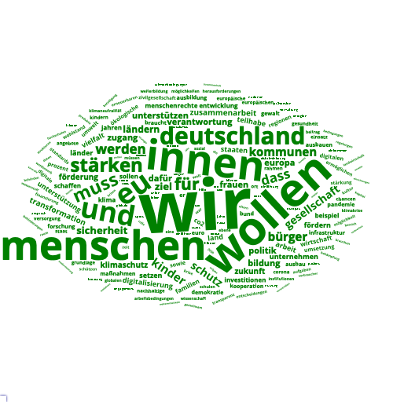
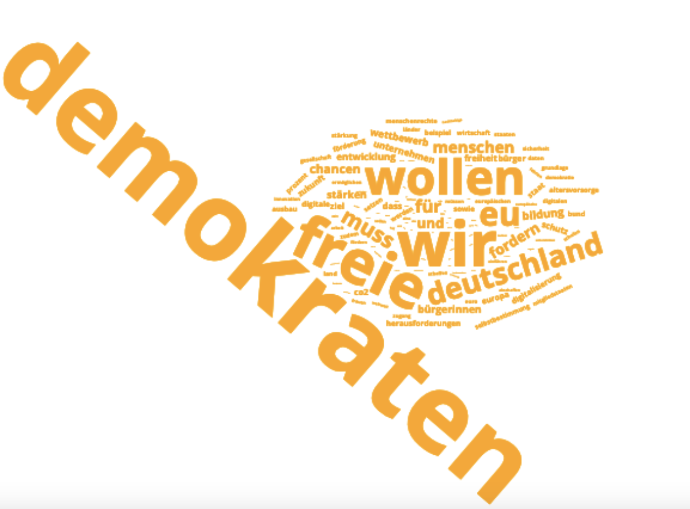
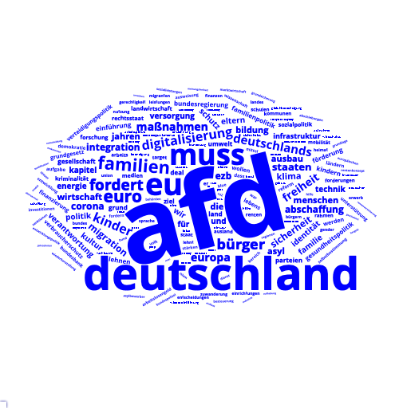
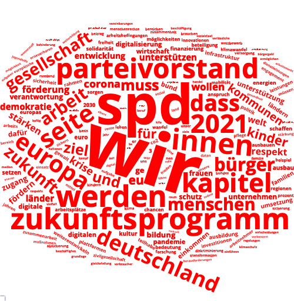
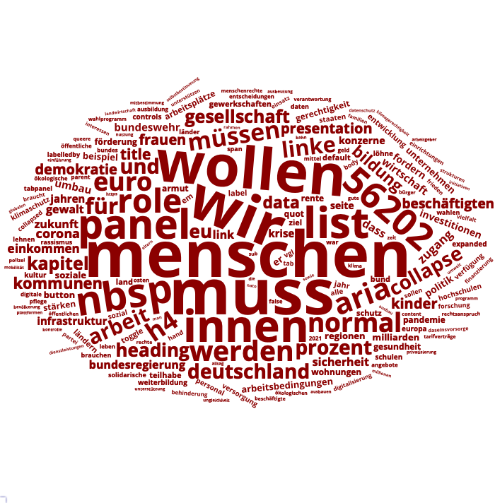

```{r setup, include=FALSE}
knitr::opts_chunk$set(echo = TRUE)
```

## Quantitative Analyse von Wahlprogrammen

In diesem kurzen Tutorial möchte ich am Beispiel der Wahlprogramme der derzeit im Bundestag vertretenen Parteien für die Bundestagswahl 2021 zeigen, wie man mit Hilfe von [R](https://cran.r-project.org/) einfache Keyword-Analysen durchführen kann. Wer dem Tutorial wirklich folgen möchte, muss Grundkenntnisse in R mitbringen - einen ersten Einstieg bietet beispielsweise mein entsprechendes Tutorial [hier](https://hartmast.github.io/sprachgeschichte-begleitmaterial/) ebenso wie zahlreiche andere Ressourcen, die online zu finden sind. Wer einfach nur den Prozess verfolgen und die Ergebnisse sehen möchte, kann aber gern mitlesen bzw. den Code copy&pasten, ohne genauer verstehen zu müssen, was "hinter den Kulissen" passiert.


## Pakete

Wir laden zunächst ein paar Zusatzpakete: pdftools erlaubt uns, PDF-Dateien einzulesen; die "tidyverse"-Paketfamilie bietet einige nützliche Funktionen für die Datenaufbereitung und -analyse, und das "tidytext"-Paket vereinfacht die Arbeit mit n-Grammen (dazu später mehr). Die Pakete "wordcloud" und "wordcloud2" erlauben die Erstellung von Wortwolken, was wir gegen Ende des Tutorials tun wollen -- wissenschaftlich gesehen kein besonders erkenntnisträchtiges Visualisierungsformat, aber durchaus geeignet, um einen ersten Eindruck von den Daten zu gewinnen, und daher auch in der populärwissenschaftlichen Vermittlung von (sprach-)wissenschaftlichen Forschungsergebnissen sehr populär. Weil beide Pakete ihre Vor- und Nachteile haben, probieren wir sie beide aus. Das Paket "stopwords" schließlich brauchen wir, um die titelgebenden Stopwords auszuschließen - was das ist, werden wir ebenfalls weiter unten erfahren.

```{r pkgs, message = FALSE, warning = FALSE} 

# falls noch nicht installiert, können Sie die benötigten
# Pakete wie folgt installieren (das # am Zeilenanfang
# entfernen, um den Code ausführen zu können):

# install.packages("pdftools")
# install.packages("tidytext")
# install.packages("pdftools")
# install.packages("wordcloud2")
# install.packages("stopwords")


# packages ----------------------------------------------------------------
library(tidyverse)
library(tidytext)
library(pdftools)
library(wordcloud)
library(wordcloud2)
library(patchwork)
library(stopwords)


```


## Daten einlesen

Das Wichtigste zuerst: Wir müssen die Texte der einzelnen Programme einlesen. Die Programme liegen zumeist im PDF-Format vor. Einzig bei der Linken findet sich (Stand 09.07.2021) kein PDF, daher nehmen wir mit der HTML-Variante vorlieb (die ohnehin einfacher einzulesen ist).

```{r getdata, warnings = FALSE, message = FALSE, eval = FALSE}

spd <- pdftools::pdf_text("https://www.spd.de/fileadmin/Dokumente/Beschluesse/Programm/SPD-Zukunftsprogramm.pdf")
gruene <- pdftools::pdf_text("https://cms.gruene.de/uploads/documents/Vorlaeufiges-Wahlprogramm_GRUENE-Bundestagswahl-2021.pdf")
cdu <- pdftools::pdf_text("https://www.ein-guter-plan-fuer-deutschland.de/programm/CDU_Beschluss%20Regierungsprogramm.pdf")
fdp <- pdf_text("https://www.fdp.de/sites/default/files/2021-06/FDP_Programm_Bundestagswahl2021_1.pdf")
afd <- pdf_text("https://cdn.afd.tools/wp-content/uploads/sites/111/2021/06/20210611_AfD_Programm_2021.pdf")
linke <- readLines("https://www.die-linke.de/wahlen/wahlprogramm-2021/")


```

```{r export, eval = FALSE, include = FALSE}

# saveRDS(linke, "linke.Rds")
# saveRDS(afd, "afd.Rds")
# saveRDS(fdp, "fdp.Rds")
# saveRDS(spd, "spd.Rds")
# saveRDS(gruene, "gruene.Rds")

```

```{r reimport, include = FALSE}

spd <- readRDS("spd.Rds")
fdp <- readRDS("fdp.Rds")
gruene <- readRDS("gruene.Rds")
afd <- readRDS("afd.Rds")
linke <- readRDS("linke.Rds")

```

Nun haben wir die Wahlprogramme in jeweils einem Objekt gespeichert, das nach den einzelnen Parteien benannt ist. Streng genommen wäre es sinnvoll, diese Daten noch zu bereinigen, da beispielsweise das Linken-Programm, weil wir es aus der HTML-Seite extrahiert haben, noch HTML-Markup und sog. Boilerplate-Text enthält, also Text, der auf praktisch allen (Unter-)Seiten wiederverwendet wird.

```{r example}

head(linke, 10)

```

Ähnlich gibt es bei den anderen Programmen z.B. Seitenzahlen, die wir bei einer sorgfältigeren Analyse tilgen würden. Auch wäre es sinnvoll, statt mit den Wortformen mit Lemmas (also Grundformen von Wörtern) zu arbeiten -- dafür müssten wir aber mit Lemmatisierung oder zumindest mit [Stemming](https://en.wikipedia.org/wiki/Stemming) arbeiten. Wer sich zur Lemmatisierung (und zum Wortartentagging) mit Hilfe des verbreiteten Tools TreeTagger näher einlesen möchte, findet bei [Noah Bubenhofer](http://www.bubenhofer.com/korpuslinguistik/kurs/index.php?id=eigenes_postagging.html) weiterführende Informationen. Mit [TagAnt](https://www.laurenceanthony.net/software/tagant/) von Laurence Anthony gibt es mittlerweile auch eine grafische Benutzeroberfläche für den TreeTagger.

Für unsere illustrative Analyse wollen wir uns aber mit den hier vorliegenden unsauberen Datensätzen begnügen und sie nur minimal weiter bereinigen (s.u.).


## Vergleichsdatensatz

Für die Analyse bieten sich nun mehrere Optionen an. Bei einer Keyword-Analyse geht es darum, herauszufinden, welche Wörter für einen gegegebenen Datensatz besonders charakteristisch sind. Dafür braucht man natürlich einen Vergleichsdatensatz. Wir werden im Folgenden die Wortfrequenzliste des [Digitalen Wörterbuchs der Deutschen Sprache](https://www.dwds.de) verwenden. Diese lässt sich über [das Tool "Dstar"](https://kaskade.dwds.de/dstar/kern/) mit der Suchanfrage
`count(* #sep)` erstellen. Wir lesen sie hier ein:

```{r vgl}

dwds <- read_delim("dwds_kern_frequency_list.txt", delim = "\t", quote = "", col_names = c("Freq", "Token"))

```

Außer mit einzelnen Wörtern können wir auch mit *N-Grammen* arbeiten. N-Gramme sind Wortfolgen von jeweils N Wörtern -- ein Satz wie *Das Pferd frisst keinen Gurkensalat* lässt sich zerlegen in die Bigramme (2-Gramme) *Das Pferd, frisst keinen, keinen Gurkensalat* oder in die Trigramme (3-Gramme) *Das Pferd frisst, Pferd frisst keinen, frisst keinen Gurkensalat*. Das Prinzip dabei ist ähnlich wie bei der Keyword-Analyse auf Einzelwortebene: Wir wollen wissen, welche Wortfolgen besonders häufig vorkommen. Für die n-Gramm-Analyse werden wir allerdings keine existierende N-Gramm-Liste als Vergleichsdatensatz verwenden, sondern vielmehr die N-Gramm-Listen der einzelnen Parteien miteinander vergleichen.


## Wortfrequenzlisten der Parteiprogramme

Um zunächst die Einzelwortfrequenzen der Parteiprogramme mit der DWDS-Frequenzliste vergleichen zu können, müssen wir zunächst eine Tabelle mit den Wortfrequenzen in den einzelnen Dokumenten erstellen - man spricht hier manchmal auch von einer *term-document matrix*. Bevor wir das tun, bereinigen wir die Daten zunächst noch, indem wir die Interpunktion, Zeilenumbrüche etc. entfernen. Außerdem heben wir Groß- und Kleinschreibung auf, um die Daten besser analysieren zu können. Daraufhin nutzen wir die `strsplit`-Funktion, mit denen man, wie ihr Name verrät, Strings splitten kann, um an die einzelnen Wörter (definiert als das, was zwischen zwei Leerzeichen steht) zu gelangen. Dafür splitten wir den Text an den Leerzeichen auf. Wir erhalten dann einen sehr großen Vektor mit Einzelwörtern, die wir daraufhin mit der `table`-Funktion auszählen und in einen Dataframe überführen. Das Ganze gießen wir in eine Funktion, die wir auf die einzelnen Parteiprogramme anwenden können.

```{r bereinigung}

count_tokens <- function(d) {
  # Interpunktion und Zeilenumbrüche weg:
d <- gsub("[[:punct:]]|\n", " ", d)

# Tabstopps und mehrere Leerzeichen durch einfache Leerzeichen ersetzen:
d <- gsub("\t| +", " ", d)

# Groß- und Kleinschreibung entfernen:
d <- tolower(d)

# an Leerzeichen splitten, um an die Einzelwörter zu kommen:
d <- unlist(strsplit(d, " "))

# Wörter auszählen:
d <- table(d) %>% as.data.frame %>% arrange(desc(Freq))

# Spaltennamen umbenennen:
colnames(d) <- c("Token", "Freq")

return(d)

}

# Funktion auf die einzelnen Wahlprogramme anwenden:
fdp <- count_tokens(fdp)
spd <- count_tokens(spd)
afd <- count_tokens(afd)
gruene <- count_tokens(gruene)
linke <- count_tokens(linke)

```

Nun haben wir also Frequenzlisten für die einzelnen Parteien. Ein kurzer Blick in die häufigsten Wörter zeigt, dass sie uns nicht viel sagen, weil es sich zum großen Teil um dieselben Funktionswörter handelt:

```{r freqs}

head(fdp)
head(spd)

```

(Auf den ersten Blick auffällig ist lediglich die Häufigkeit von *werden* im SPD-Programm, das sie wohl nicht umsonst als "Zukunftsprogramm" betitelt hat.)

## Keywords

Wir wollen aber wissen, welche Wörter für die Wahlprogramme charakteristisch sind, welche also deutlich häufiger auftreten als in einem Vergleichsdatensatz. 

### Assoziationsmaße

Um Keywords herausfinden zu können, stützen wir uns auf Assoziationsmaße. Davon gibt es eine ganze Menge (Evert 2005 gibt einen Überblick), wir benutzen zwei: [Log-Likelihood ratio](https://en.wikipedia.org/wiki/Likelihood-ratio_test) und den [Sørensen–Dice-Koeffizienten](https://en.wikipedia.org/wiki/S%C3%B8rensen%E2%80%93Dice_coefficient), oft auch nur Dice-Koeffizient genannt. Für beide Koeffizienten brauchen wir zunächst Funktionen. Die Funktionen habe ich aus Material übernommen, das meine Erlanger Kollegen Andreas Blombach und Phillip Heinrich für ein Seminar erarbeitet haben und das mit einiger Wahrscheinlichkeit auch Eingang in ein gemeinsames Buchprojekt finden wird, über das ich hoffentlich an anderer Stelle bald mehr berichten kann.

#### Log-Likelihood Ratio

```{r llr}

# diese Hilfsfunktion berechnet die erwarteten Frequenzen:
exp2x2 <- function(observed) {
  return(matrix(
    c(
      sum(observed[1,]) * sum(observed[,1]) / sum(observed),
      sum(observed[2,]) * sum(observed[,1]) / sum(observed),
      sum(observed[1,]) * sum(observed[,2]) / sum(observed),
      sum(observed[2,]) * sum(observed[,2]) / sum(observed)
    ),
    ncol = 2
  ))
}

# diese Funktion berechnet die Log-Likelihood Ratio:
llr <- Vectorize(function(freq1, freq2, corpus_size1, corpus_size2) {
  observed <- matrix(c(freq1, corpus_size1 - freq1,
                       freq2, corpus_size2 - freq2),
                     ncol = 2)
  expected <- exp2x2(observed)
  return(2 * sum(ifelse(observed > 0, observed * log(observed / expected), 0)))
})


```


#### Dice-Koeffizient

```{r dice}

dice <- Vectorize(function(freq1, freq2, corpus_size1, corpus_size2) {
  observed <- matrix(c(freq1, corpus_size1 - freq1,
                       freq2, corpus_size2 - freq2),
                     ncol = 2)
  return(2 * observed[1, 1] / sum(observed[1, 1], observed[1, 2],
                                  observed[1, 1], observed[2, 1]))
})

```


### Anwendung der Assoziationsmaße

Die eben erstellten Funktionen `llr` und `dice` nehmen beide vier Argumente, also Variablen, mit denen wir sie "füttern" müssen: Die Frequenz der einzelnen Tokens in unserem Korpus (dem jeweiligen Wahlprogramm) und im Vergleichskorpus sowie die Gesamtfrequenz aller Tokens in den beiden Korpora. Um Letztere greifbar zu haben, erstellen wir sie, indem wir einfach die Frequenzen in den entsprechenden Dataframes aufsummieren:

```{r freqs2}

# Wahlprogramme:
gruene_size <- sum(gruene$Freq)
spd_size <- sum(spd$Freq)
fdp_size <- sum(fdp$Freq)
afd_size <- sum(afd$Freq)
linke_size <- sum(linke$Freq)

# DWDS:
dwds_size <- sum(dwds$Freq)

```

Nun können wir die LLR- bzw. Dice-Werte bekommen, indem wir die entsprechenden Werte einfach in die oben definierten Funktionen einsetzen. Wir nutzen hier die `left_join`-Funktion aus der Tidyverse-Paketfamilie, um zunächst an das jeweilige Parteiprogramm eine Spalte anzuhängen, die die DWDS-Gesamtfrequenzen aus dem `dwds`-Dataframe enthält, und dann die `mutate`-Funktion, um die LLR- und Dice-Werte einfach als weitere Spalten an die Wahlprogramme anzuhängen. Als Beispiel wählen wir einfach die alphabetisch erste der demokratisch ausgerichteten Parteien:

```{r bspfdp}

# Spaltennamen ändern, um Gesamtfrequenz von FDP-Frequenz unterscheiden zu können:
colnames(fdp) <- c("Token", "Freq_fdp")

# DWDS-Frequenzen hinzufügen:
fdp <- left_join(fdp, dwds)

# NAs durch 0 ersetzen
fdp <- replace_na(fdp, list(Freq = 0, Freq_fdp = 0))

# Spalte mit Log-Likelihood hinzufügen:
fdp <- fdp %>% mutate(LLR = llr(fdp$Freq_fdp, fdp$Freq, fdp_size, dwds_size))

# Spalte mit Dice hinzufügen:
fdp <- fdp %>% mutate(Dice = dice(fdp$Freq_fdp, fdp$Freq, fdp_size, dwds_size)) %>% arrange(desc(LLR))

# Top 10, nach LLR sortiert (über arrange(desc(LLR)), s.o.)
fdp %>% head(10)

# nach Dice sortieren:
fdp %>% arrange(desc(Dice)) %>% head(10)

```

Dieses erste Ergebnis ist schon deutlich aufschlussreicher als die reine Tokenfrequenz, die wir oben angeschaut haben: Die Freien Demokraten wollen irgendetwas und fordern, dass Menschen - oder so. Und irgendwas mit EU. Schon die ersten zehn Keywords verraten relativ viel über zweierlei: Zum einen über die inhaltlichen Themen des Wahlprogramms, zum anderen - und das kommt zumindest bei den Top 10 noch etwas stärker zum Tragen - über die rhetorischen Strategien, die im Wahlprogramm angewandt werden. 

Da wir das nun auch für die anderen Parteien machen wollen, lohnt es sich, das Ganze wieder in eine Funktion zu gießen und dann auf alle Parteien anzuwenden:

```{r getllranddice}

# Funktion:

association_measures <- function(df) {
  
# welche Partei ist gerade dran? mit deparse(substitute())
# erhalten wir den Namen der Partei als character string:
partei <- deparse(substitute(df))

# das ist wichtig, weil wir die size-Variable der
# entsprechenden Partei brauchen.
df_size <- get(paste0(partei, "_size"))
    
# Spaltennamen ändern, um Gesamtfrequenz von df-Frequenz unterscheiden zu können:
colnames(df) <- c("Token", "Freq_df")

# DWDS-Frequenzen hinzufügen:
df <- left_join(df, dwds)

# NAs durch 0 ersetzen
df <- replace_na(df, list(Freq = 0, Freq_df = 0))

# Spalte mit Log-Likelihood hinzufügen:
df <- df %>% mutate(LLR = llr(df$Freq_df, df$Freq, df_size, dwds_size))

# Spalte mit Dice hinzufügen:
df <- df %>% mutate(Dice = dice(df$Freq_df, df$Freq, df_size, dwds_size)) %>% arrange(desc(LLR))

# ausgeben
return(df)

}


# auf die einzelnen Parteien angewendet:
spd <- association_measures(spd)
linke <- association_measures(linke)
afd <- association_measures(afd)
gruene <- association_measures(gruene)

```

## Wortwolken

Wir wollen nun die Daten mit Hilfe von Wortwolken visualisieren, wobei die Größe der Wörter mit der LLR korrelieren soll. Da so eine Wolke schnell sehr unübersichtlich wird, beschränken wir uns auf die 200 Treffer mit der höchsten LLR - da wir die Daten oben nach LLR sortiert haben, können wir hierfür einfach die `head`-Funktion benutzen, die uns die ersten n Treffer ausgibt (hier: die ersten 200). Den LLR-Wert teilen wir durch 20, da die Wörter in der Darstellung sonst zu groß werden würden. Optional können wir noch sog. *stopwords* ausschließen (dafür die entsprechenden Zeilen auskommentieren). Das sind Wörter, die in einer Sprache sehr häufig vorkommen und daher nicht unbedingt besonders aussagekräftig sind. Hier lassen wir sie aber zunächst drin, weil auch sonst uninteressante Alltagswörter wie *wir* in diesem Kontext durchaus spannend sein können.

### Paket "wordcloud"

Benutzen wir zunächst das Paket "wordcloud", das den Vorteil hat, dass die entstehenden Wortwolken relativ gut als hochauflösende Daten exportiert werden können.

```{r wordcloud,  message=FALSE, warning=FALSE}

# Stopwords ausschließen
# gruene <- gruene[which(!gruene$Token %in% stopwords("de")),]
# fdp <- fdp[which(!fdp$Token %in% stopwords("de")),]
# afd <- afd[which(!afd$Token %in% stopwords("de")),]
# spd <- spd[which(!spd$Token %in% stopwords("de")),]
# linke <- linke[which(!linke$Token %in% stopwords("de")),]

# Seed setzen, damit immer die gleiche Wolke entsteht
# (da die Anordnung der Wörter zufallsgeneriert ist)
set.seed(1985)

# Wortwolken erstellen


gruene200 <- head(gruene, 200)
wordcloud(words = gruene200$Token, freq = gruene200$LLR/20, col = "green", scale = c(3, .01))


```


```{r expcloud, include = FALSE, eval = FALSE}

library(webshot)
library(htmlwidgets)

# save graph into an object:
my_graph <- mutate(head(gruene, 200), LLRby = LLR/20) %>% select(Token, LLRby) %>% wordcloud2(size = .5, minSize = .4, color = "green", fontFamily = "Open Sans") 

my_graph2 <- mutate(head(fdp, 200), LLRby = LLR/20) %>% select(Token, LLRby) %>% wordcloud2(size = .5, minSize = .4, color = "orange", fontFamily = "Open Sans") 

my_graph3 <- mutate(head(afd, 200), LLRby = LLR/20) %>% select(Token, LLRby) %>% wordcloud2(size = 1.5, minSize = .6, color = "blue", fontFamily = "Open Sans") 

my_graph4 <- mutate(head(spd, 200), LLRby = LLR/20) %>% select(Token, LLRby) %>% wordcloud2(size = .7, minSize = .4, color = "red", fontFamily = "Open Sans") 

my_graph5 <- mutate(head(filter(linke, !Token %in% c("li", "strong", "div", "p", "class", "ul", "nav", "h2", "bnsp", "accordion", "href", "a", "id", "h3")), 200), LLRby = LLR/20) %>% select(Token, LLRby) %>% wordcloud2(size = .5, minSize = .4, color = "darkred", fontFamily = "Open Sans") 

# save graph locally, then insert it:
saveWidget(my_graph, "tmp.html", selfcontained = F)
webshot("tmp.html", "wc1.png", delay = 15, vwidth = 500, vheight = 500)

saveWidget(my_graph2, "tmp.html", selfcontained = F)
webshot("tmp.html", "wc2.png", delay = 15, vwidth = 500, vheight = 500)

saveWidget(my_graph3, "tmp.html", selfcontained = F)
webshot("tmp.html", "wc3.png", delay = 15, vwidth = 500, vheight = 500)

saveWidget(my_graph4, "tmp.html", selfcontained = F)
webshot("tmp.html", "wc4.png", delay = 15, vwidth = 500, vheight = 500)

saveWidget(my_graph5, "tmp.html", selfcontained = F)
webshot("tmp.html", "wc5.png", delay = 15, vwidth = 700, vheight = 700)

```








```{r weiter}

png("afd.png", width = 12, height = 6.5, un = "in", res = 300)
mutate(head(afd, 100), LLRby = LLR/20) %>% select(Token, LLRby) %>% wordcloud2(size = .5, minSize = .05, color = "blue", fontFamily = "Open Sans")
dev.off()

mutate(head(fdp, 100), LLRby = LLR/20) %>% select(Token, LLRby) %>% wordcloud2(size = .5, minSize = .05, color = "orange", fontFamily = "Open Sans")

mutate(head(spd, 100), LLRby = LLR/20) %>% select(Token, LLRby) %>% wordcloud2(size = .3, minSize = .05, color = "red", fontFamily = "Open Sans")

mutate(head(linke, 100), LLRby = LLR/20) %>% select(Token, LLRby) %>% wordcloud2(size = 3, minSize = .05, color = "darkred", fontFamily = "Open Sans")


```


## Literatur

Evert, Stefan. 2005. The statistics of word cooccurrences. Word pairs and collocations. Stuttgart: Institut für maschinelle Sprachverarbeitung.

